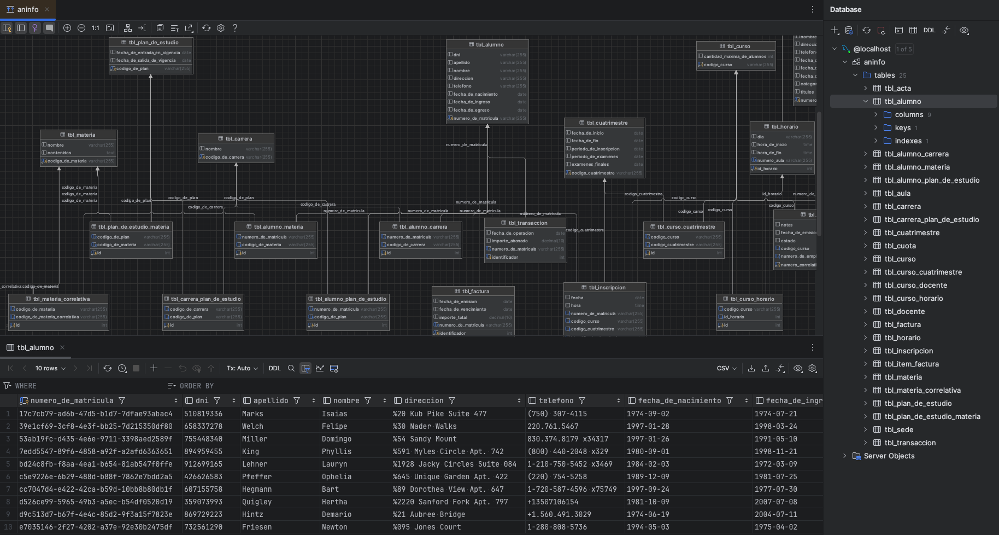

# UPP Database Seeder and Setup

The UPP database, seeding it with fake data using Gorm and Faker in Go, and running it in a Docker container.

## 🌟 Features

- **Database Setup**: Instructions to set up a MySQL database using Docker.
- **Database modeling with Gorm**: Define the database schema using Go structs and Gorm tags.
- **Database Seeding**: Seed the database with initial and related data using Go, Gorm, and Faker.
  

## 🛠️ Installation

To set up the UPP database on your local environment, follow these steps:

1. **Clone the Repository**:

   ```bash
   git clone https://github.com/LuisCusihuaman/aninfo-upp-db-2024-1C-101805
   cd aninfo-UPP-db-2024-1C-101805
   ```

2. **Build and Run with Docker Compose**:

   Ensure you have Docker and Docker Compose installed. Then, run the following command to build and start the services:

   ```bash
   docker compose up --build
   ```

3. **Stop and Remove Containers and Volumes**:

   When you need to stop and clean up the setup, use the following command:

   ```bash
   docker compose down -v
   ```

## 📖 Database Operations

After the database is up and running, you can connect to the MySQL service to perform operations like showing tables and
describing table structures.

1. **Connect to the Database**:

   ```bash
   docker compose exec db mysql -u root
   ```

   When prompted, just press Enter as the password is empty.

2. **Show Tables**:

   Once connected to the MySQL shell, use the following command to show all tables in the `UPP` database:

   ```sql
   USE UPP;
   SHOW TABLES;
   ```

3. **Describe `tbl_alumno` Table**:

   Use the following command to describe the structure of the `tbl_alumno` table:

   ```sql
   DESCRIBE tbl_alumno;
   ```
   
```markdown
   mysql> DESCRIBE tbl_alumno;
   +---------------------+--------------+------+-----+---------+-------+
   | Field               | Type         | Null | Key | Default | Extra |
   +---------------------+--------------+------+-----+---------+-------+
   | numero_de_matricula | varchar(255) | NO   | PRI | NULL    |       |
   | dni                 | varchar(255) | YES  |     | NULL    |       |
   | apellido            | varchar(255) | YES  |     | NULL    |       |
   | nombre              | varchar(255) | YES  |     | NULL    |       |
   | direccion           | varchar(255) | YES  |     | NULL    |       |
   | telefono            | varchar(255) | YES  |     | NULL    |       |
   | fecha_de_nacimiento | date         | YES  |     | NULL    |       |
   | fecha_de_ingreso    | date         | YES  |     | NULL    |       |
   | fecha_de_egreso     | date         | YES  |     | NULL    |       |
   +---------------------+--------------+------+-----+---------+-------+
   9 rows in set (0.01 sec)
```

## 🤝 Contributors

Contributions are welcome!

Feel free to submit a pull request or open an issue for any improvements or bug fixes.
